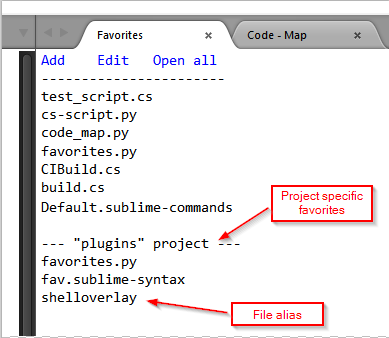
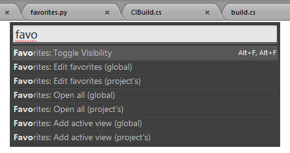

# Sublime Favorites

A plugin for displaying Favorites (list of frequently used documents) in the [Sublime Text 3](http://sublimetext.com "Sublime Text") editor.

While plugin functionality overlaps with some other similar ST3 plugins, it has a very strong distinction - it offers visual management of the Favorites' items.

## Installation

Note the plugin was developed and tested against ST3 but not ST2.

*__Package Control__*

_Not available yet: waiting for Sublime team approval._<br>
You can install the pluging [Package Control](https://packagecontrol.io/packages/Favorites).

*__Manual__*

* Remove the package, if installed, using Package Control.
* Add a repository: `https://github.com/oleg-shilo/sublime-favorites.git`
* Install `sublime-favorites` with Package Control. 

You can also install the plugin by cloning `sublime-favorites` repository into your Packages folder or manually placing the download package there.

## Usage
The plugin uses a dedicated view group on right side (favorites panel) to mimic a "side bar" containing the list of "favorite documents".

All visual elements in the panel can be double-clicked to invoke the default command associated with the element. Alternatively user can hover the mouse cursor over the item to trigger an interactive tooltip, which allows invoking multiple commands associated with the visual element.

To start working with Favorites just make the favorites panel visible (e.g. press `cmd+shift+p` and type/select `Favorites: Toggle Visibility`). 

Alternatively, you can configure custom binding instead:

_Open keymap menu_

Preferences > Key Bindings > Default (...).sublime-keymap - User

_Add mapping:_

```
{ "keys": ["alt+f", "alt+f"], "command": "show_favorites" }
```


## Functionality

1. *Toggle Visibility*  
    Show/Hide favorites panel either with *Command Palette* or by the configured shortcut (e.g. [alt+f, alt+f]).

2. *Add active document to favorites*  
    Double-click the `Add` command at the top of the panel.  
    Alternatively, hover over `Add` command at the top of the panel and then click `Add active view...` on the tooltip.

3. Remove the item (document) from the favorites.  
    Hover over the document item in the panel and then click `Remove from...` on the tooltip.

4. *Open the item (document)*  
    Double-click the document item in the panel.  
    Alternatively, hover the document item in the panel and then click `Open...` on the tooltip.

5. *Edit Favorites data file directly*  
    Double-click the `Edit` command at the top of the panel.  
    Alternatively, hover over `Edit` command at the top of the panel and then click `Edit...` on the tooltip.

6. *Project specific favorites*
    The plugin maintains a separate list of favorites per project. It is merged with the global favorites if the project file is loaded into ST. The project favorites are always placed in the bottom section of the favorites panel. All per-project items can be dealt with (e.g. Add, Remove, edit) the same ways as global ones. 

7. *File aliases*
    By default the items in the favorites panel appears with their file name listed. However if a custom name is more beneficial a file alias can be assigned to the item in the data file via "Edit favorites" command.

    The format is simple: `<file_alias>|<file_path>`: 
    ``` 
    shelloverlay|Q:\Extras\Utils\TortoiseIconOverlays.cs
    ```




Practically all functionality available via favorites panel is also available via *Command Palette*:


## Settings

You can also configure plugin to:
1. Hide the group on closing the panel when it is the only view in the group.
2. Always place favorites panel in the individual most-right column. Only up to 4 columns layout is supported.is alse available
3. Use [Favorite Files](https://github.com/facelessuser/FavoriteFiles) plugin data file.<br> 
The integration is limited to reading `Favorite Files` data file, flattening it and allowing to open files on double-click on the item in the Favorites panel.

_favorites.sublime-settings_

```js
{
    "close_empty_group_on_closing_panel": true, 
    "show_in_new_group": true,
    "favorite_files_integration_enabled": false
}
```
